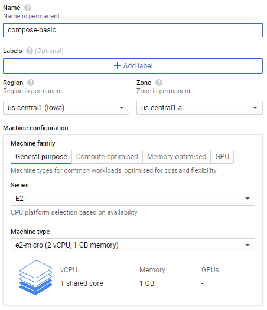
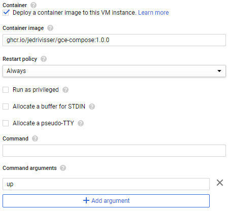
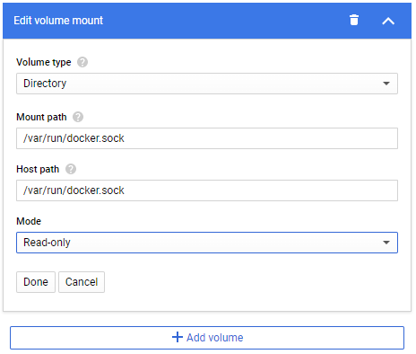
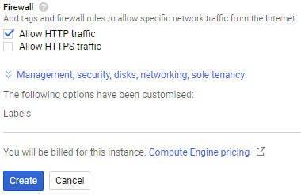
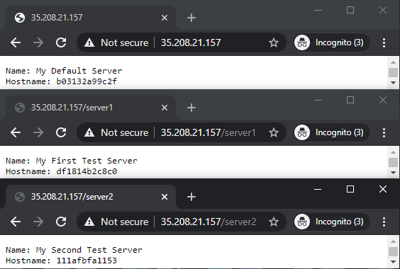
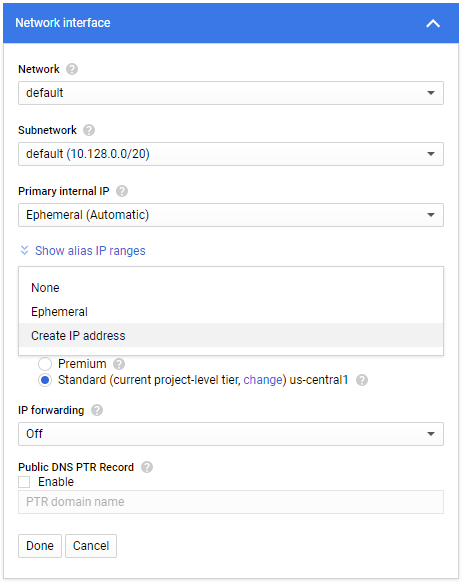
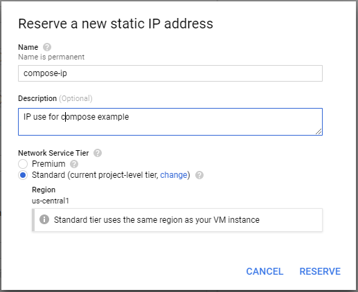
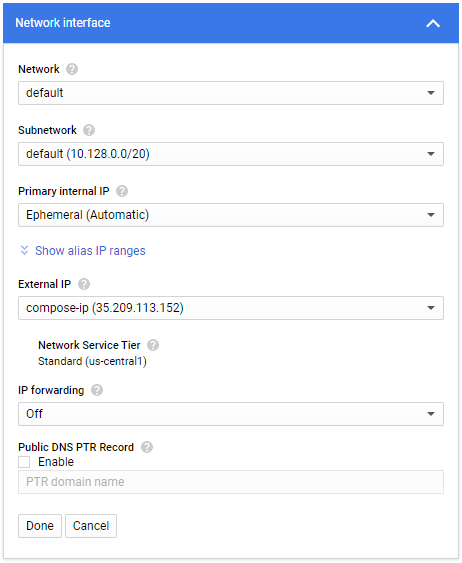
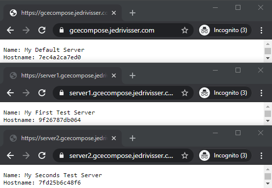

# Run docker-compose on GCE
https://jedri.medium.com/run-docker-compose-on-gce-a5a49f64225e
https://github.com/jedrivisser/gce-compose

I created this experiment because I wanted a way to run a managed docker-compose stack.

There are many services that will run a docker container for you and many services that will manage a k8s deployment for you, but sometimes one docker container is not enough and k8s is just way too much for a hobby project or internal tool.

This projects uses a GCE VM instance to host a docker-compose stack.

GCE allows you to [deploy a container][deploy-container] that it will always keep running.

> ⚠️ This project uses [traefik][traefik-website] for a reverse proxy to expose multiple services on the same port. The examples I use can be run as is for a proof of concept, but to customize the examples for your own project you will need an understanding of how traefik works and it is not discussed in detail here.

## The Idea

Extend the `docker/compose` image by adding my own `docker-compose.yml` to it. I can then use that to run multiple docker containers masquerading as one docker container.

You can then run it with something like:

```sh
docker build -t example .
docker run --rm -ti \
  -v /var/run/docker.sock:/var/run/docker.sock \
  example up
```

## Basic compose file

`docker-compose.yml` runs three http services.

It uses [traefik][traefik-website] to route you to each service based on the path you navigate to.

To test it locally run:

```sh
docker-compose up
```

Any URL starting with `http://localhost/server1` will route you to server1.  
Any URL starting with `http://localhost/server2` will route you to server2.  
Any other URL will route you to the default server.

## Compose file with https, SNI and Let's Encrypt certificates

`docker-compose.advanced.yml` runs three https services.

It uses `traefik` to route you to each service based on hostname.

It uses Let's Encrypt to generate certificates for all three services.

You set the default server's hostname with the environment variable `BASE_URL`.

Any URL starting with `https://server1.${BASE_URL}` will route you to server1.  
Any URL starting with `https://server2.${BASE_URL}` will route you to server2.  
Any URL starting with `https://${BASE_URL}` route you to the default server.

To test it locally run:

```sh
docker-compose -f docker-compose.advanced.yml up
```

By default the `BASE_URL` will be `localhost` and you will not be able to get Let's Encrypt certificates, but you can still test it.

## GCE Setup

This is GCE setup instructions for using the image from my basic `Dockerfile`.

You will need to log in to [GCP][gcp-console] and create a project with billing enabled.

Then go to `Compute Engine -> VM Instances` and [create an instance][create-instance].

Choose the name, region, zone, machine type etc. that you prefer (or use the defaults).



Tick `Deploy a container image to this VM instance.`

At `Container image` enter `ghcr.io/jedrivisser/gce-compose:1.0.0`.

Click `Advanced container options` to see more options.

Under `Command arguments` click `Add argument` and enter `up`.



Under `Volume mounts` select `Add volume` and add a volume mount with:

| Name        | Value                |
| ----------- | -------------------- |
| Volume type | Directory            |
| Mount path  | /var/run/docker.sock |
| Host path   | /var/run/docker.sock |
| Mode        | Read-only            |



At firewall select `Allow HTTP traffic`.

Then click `Create` and wait a few minutes for it to start up.



That's it! You can now access your services on the external IP GCE assigned to you.


In my case `http://35.208.21.157/`, `http://35.208.21.157/server1` and `http://35.208.21.157/server2`.



## GCE Setup Advanced

> ⚠️ You will need to own a domain or have access to add DNS entries to one.

This is GCE setup instructions for using the image from my `advanced.Dockerfile`.

You will need to log in to [GCP][gcp-console] and create a project with billing enabled.

Then go to `Compute Engine -> VM Instances` and [create an instance][create-instance].

You will probably want a static external IP for this https setup so first go to the bottom of the instance setup page.

Click `Management, security, disks, networking, sole tenancy` to see more options.

Select the `Networking` tab and under `External IP` select `Create IP address`.



Give it some name and description that makes sense and select `Reserve`.



In my case I now have the IP `35.209.113.152`.



Add 3 DNS entries that reference this IP, `${BASE_URL}`, `server1.${BASE_URL}` and `server2.${BASE_URL}`. My DNS is managed by Cloudflare so I added it there.


Now lets go back to the top of the page and configure the VM.

Choose the name, region, zone, machine type etc. that you prefer (or use the defaults).

Tick `Deploy a container image to this VM instance.`

At `Container image` enter `ghcr.io/jedrivisser/gce-compose/advanced:1.0.0`.

Click `Advanced container options` to see more options.

Under `Command arguments` click `Add argument` and enter `up`.

Under `Environment variables` click `Add variable` and add your BASE_URL for this service, in my case:

| Name     | Value                      |
| -------- | -------------------------- |
| BASE_URL | gcecompose.jedrivisser.com |

Under `Volume mounts` select `Add volume` and add a volume mount with:

| Name        | Value                |
| ----------- | -------------------- |
| Volume type | Directory            |
| Mount path  | /var/run/docker.sock |
| Host path   | /var/run/docker.sock |
| Mode        | Read-only            |

At firewall select `Allow HTTP traffic` and `Allow HTTPS traffic`.

Then click `Create` and wait a few minutes for it to start up.

That's it! You can now access your services on the specified hostname.

In my case `https://gcecompose.jedrivisser.com`, `https://server1.gcecompose.jedrivisser.com` and `https://server2.gcecompose.jedrivisser.com`.



## Limitations

There are probably more restrictions that I will add if I think of them / encounter them, but for now:

- The docker-compose file cannot use volume mounts for this use case.
- Only port 80 and 443 can be exposed.

[traefik-website]: https://traefik.io/
[deploy-container]: https://cloud.google.com/compute/docs/containers/deploying-containers
[create-instance]: https://console.cloud.google.com/compute/instancesAdd
[gcp-console]: https://console.cloud.google.com/
